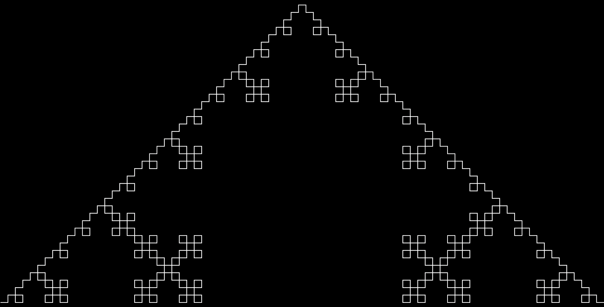

# L-System

An implementation of Lindenmayer Systems for your React application.

## Installation
```sh
> npm install @nealrame/react-l-system
```

## Example

```js
import * as React from "react"

import { useLSystem } from "@nealrame/l-system"

const app = () => {
    const rules = defineLSystemRules({
        "F": ["F", "+", "F", "-", "F", "-", "F", "+", "F"],
        "+": ["+"],
        "-": ["-"],
    })
    const actions = defineLSystemTurtleActions({
        "F": ["forward", 1],
        "+": ["turn",  Math.PI/2],
        "-": ["turn", -Math.PI/2],
    })
    const axiom = defineLSystemAxiom(["F"])
    const { path, rect } = useLSystem(rules, actions, axiom, 4)

    return <svg
        width="100%"
        height="100%"
        viewBox={`${rect.x} ${rect.y} ${rect.w} ${rect.h}`}
        preserveAspectRatio="xMidYMid meet"
        style={{ backgroundColor: "black" }}
    ><g><path
        d={ path }
        fill="none"
        stroke="white"
        strokeWidth="0.1"
        strokeLinecap="round"
    /></g></svg>
}
```

Which should produce something like :
<p align="center"></p>